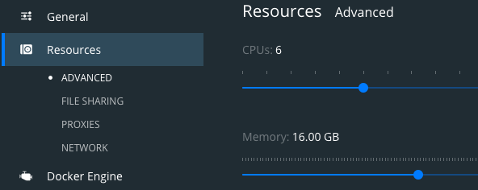

# Configuring Kubernetes on Docker-desktop


1. Make sure you allocate docker enough resources - when you create multiple shards & replicas, memory use can grow quickly



2. Ensure kubernetes is enabled.


You will get a new kubeconfig which you'll need to add to your `KUBECONFIG` in your `.bash_profile` or your `.zshrc`
 
3. Install the [kubernetes dashboard]():

```sh
kubectl apply -f kubectl apply -f https://raw.githubusercontent.com/kubernetes/dashboard/v2.3.1/aio/deploy/recommended.yaml
```

4. Set up some secutiry stuff to run the dashboard.  In a terminal (in the root of this repo) run 

```sh
kubectl apply -f k8s/user-stuff.yaml
```

5. In a new terminal, run `kubectl proxy` to allow access to the k8s api (where the dashboard is served from)


7. Get a token to acces your k8s-ui. n.b. if you aren't on a mac, you'll need to remove the ` | pbcopy` and copy the output to the clipboard yourself

```sh
kubectl -n kubernetes-dashboard get secret $(kubectl -n kubernetes[0].name}") -o go-template="{{.data.token | base64decode}}" | pbcopy
```

8. You should be able to log into the k8s ui [here](http://localhost:8001/api/v1/namespaces/kubernetes-dashboard/services/https:kubernetes-dashboard:https/proxy/.), using the token in your clipboard

